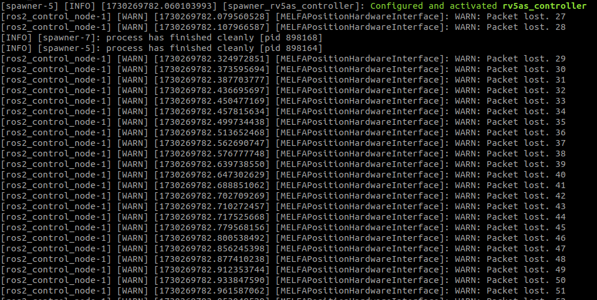
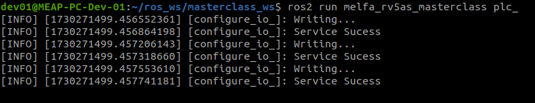
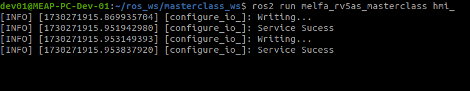

# __MELFA ROS2 Masterclass 2024__

This document provides a guided tutorial for this MELFA ROS2 Masterclass. For setup instructions, refer to [MELSOFT Simulators Setup Guide](../doc/melsoft_setup.md).
## __Overview__

This document contains 3 chapters. By the end of this tutorial, you will be able to create your own MELFA ROS2 application and create a system accurate simulation with MELSOFT Simulators.

## __1. Connect to MELSOFT Simulators__

This section provides a guide to connect to MELSOFT RT Toolbox3 Simulator.

MELSOFT RT Toolbox3 creates a system simulation of the RV-5AS collaborative robot. The simulator simulates the _Real Time External Command_ ethernet function, allowing ROS2 to connect to the simulation as if it is a real physical robot.

#### 1. Open a new terminal. Source your MELFA workspace and connect to the simulation with the command below. [Terminal 1]
```
ros2 launch melfa_bringup rv5as_control.launch.py use_fake_hardware:=false robot_ip:=<MELSOFT_PC_IP_address>
```
Eg:
```
ros2 launch melfa_bringup rv5as_control.launch.py use_fake_hardware:=false robot_ip:=192.168.3.200
```
<br/>
You will be greeted with a block of text. Do not be alarmed as the packet losses are caused by Windows not being "real-time" which results in missed replies back to MELFA ROS2 which is real-time. Running RT Toolbox3 as administrator may reduce the packet loss frequency but your mileage may vary.

<br/>


</br>

#### 2. Open a new terminal. Source your MELFA workspace and run the command below. [Terminal 2]
```
ros2 run melfa_rv5as_masterclass plc_ 
```
<br/>


</br>

#### 3. Open a new terminal. Source your MELFA workspace and run the command below. [Terminal 3]
```
ros2 run melfa_rv5as_masterclass hmi_ 
```
<br/>


</br>
You are ready!

## __2. Try out MELFA ROS2 Driver in CLI__

This

## __3. Experience a simple MELFA ROS2 application with MELSOFT simulators__

